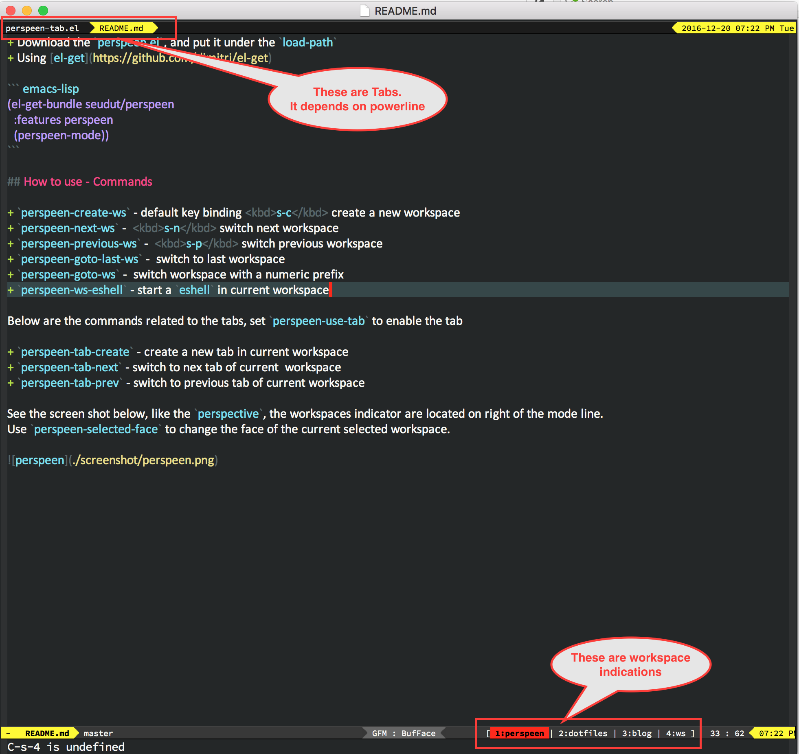

[](https://travis-ci.org/seudut/perspeen)
[](http://melpa.org/#/perspeen)

## Perspeen
This is a package for GNU Emacs in order to make it much more  convenient to work with multiple workspaces simultaneously.

## The History
Before using Emacs, I am a vimer and my coding work flow is `iTerms` + `Zsh` + `Tmux` + `Vim`.  I often open multiple tmux windows. Each window
is an workspace,  splitted with at least two panes; one pane runs `macvim`, and another pane below runs `zsh`. Each window has its own workspace.
The work flow is very convenient and efficient for me. There is a video presentation for this if your'r interested [iterm zsh tmux vim](https://www.youtube.com/watch?v=cCgJaOwCNaI)

When switch to Emacs, since I perfer the GUI Emacs, I have always been looking for a package which can replace these.

## Why named perspeen
This package is inspired from [perspective](https://github.com/nex3/perspective-el) and [elscreen](https://github.com/knu/elscreen). `perspective` is 
good, but it has not tab-persist.  This package, `perspeen`, is intended to combine both `perspective` and `elscreen`. Make the workspace has the tab-persist feature.
So the name is also combined from these two package names. `persp-een`.
Compared with `perspective`, this package supports multile tab in each workspace. Each workspace has its own tab list. Compared with `elscreen`, this package support separate the buffers against the workspace.

## Install and config
+ Download the `perspeen.el`, and put it under the `load-path`
+ Using [el-get](https://github.com/dimitri/el-get)

``` emacs-lisp
(el-get-bundle seudut/perspeen
  :features perspeen
  (setq perspeen-use-tab t)
  (perspeen-mode))
```

## How to use - Commands
The defult prefix key of `perspeen-mode` is <kbd>C-z</kbd>. It can be changed by set the variable `perspeen-keymap-prefix`. like this to change the prefix key as <kbd>C-c C-'</kbd>.

``` emacs-lisp
(setq perspeen-keymap-prefix (kbd "C-c C-'"))
```

+ `perspeen-create-ws` - default key binding <kbd>C-z c</kbd> create a new workspace.
+ `perspeen-next-ws` -  <kbd>C-z n</kbd> switch next workspace.
+ `perspeen-previous-ws` -  <kbd>C-z p</kbd> switch previous workspace.
+ `perspeen-goto-last-ws` - <kbd>C-z '</kbd> switch to last workspace.
+ `perspeen-goto-ws` -  switch workspace with a numeric prefix.
+ `perspeen-ws-eshell` - <kbd>C-z e</kbd>  start a `eshell` in current workspace.
+ `perspeen-delete-ws` - <kbd>C-z k</kbd> kill current workspace.
+ `perspeen-rename-ws` - <kbd>C-z r</kbd> rename current workspace.
+ `perspeen-change-root-dir` -<kbd>C-z d</kbd> change the root directory of current workspace.

Below are the commands related to the tabs, set `perspeen-use-tab` to enable the tab

+ `perspeen-tab-create` - <kbd>C-z t</kbd> create a new tab in current workspace
+ `perspeen-tab-del` - delete current tab in current workspac
+ `perspeen-tab-next` - switch to nex tab of current  workspace
+ `perspeen-tab-prev` - switch to previous tab of current workspace

See the screen shot below, like the `perspective`, the workspaces indicator are located on right of the mode line.
Use `perspeen-selected-face` to change the face of the current selected workspace.


